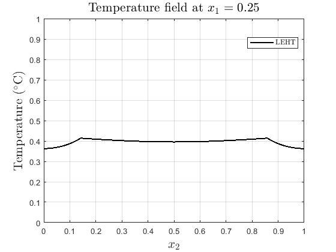
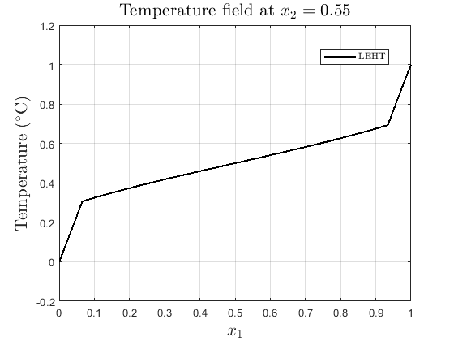

# 🔥 Effective Thermal Conductivity of Composites

This repository features MATLAB codes developed to compute the effective thermal conductivity of periodic composite materials. The implementations encompass the analytical formulation of the **Locally-Exact Homogenization Theory (LEHT)** and the numerical **Finite-Volume Theory (FVT)**, utilizing both the Mean-Field Theory approach and the energy-based approach.

The models are designed for composites consisting of an isotropic matrix and circular isotropic inclusions, represented through a periodic unit cell. In addition to determining the effective thermal conductivity matrix, the repository provides the visualization of the temperature field and the microscopic temperature profiles along the coordinate directions. Thus, this computational framework constitutes a robust tool for the comparative analysis between analytical and numerical homogenization methods. 

---

## 📐 Analytical solution

### Locally-Exact Homogenization Theory (LEHT)
The Locally-Exact Homogenization Theory (LEHT) is an analytical approach based on the Trefftz concept, in which the local fields are represented by series expansions that satisfy the governing differential equations. The solution is obtained by imposing continuity conditions at the fiber–matrix interface and periodicity conditions on the unit cell. This methodology allows the effective thermal conductivity of materials with inclusions to be determined. The LEHT formulation implemented in this repository is based on the concepts presented in **DOI:** [https://doi.org/10.1016/j.ijheatmasstransfer.2020.119477].

### Syntax

The `LEHT.m` function computes the effective thermal conductivity matrix, generates the 2D temperature field, and extracts 1D temperature profiles for a composite material considering a circular inclusion within a square matrix.
* LEHT(k_m, k_i, frac, field, x_cut, y_cut)


**Table 1:** Inputs parameters' declaration - LEHT
---
| Parameter | Description | Accepted Values |
| :---: | :--- | :---: |
| **`k_m`** | Thermal conductivity of the matrix phase. | `> 0` |
| **`k_i`** | Thermal conductivity of the inclusion phase. | `> 0` |
| **`frac`** | Volume fraction of the inclusion in the Representative Unit Cell (RUC). | `[0.05, 0.75]` |
| **`field`** | Enables or disables the plotting of the total 2D temperature field. | `0` (disable) or `1` (enable) |
| **`x_cut`** | Coordinate to extract the vertical temperature profile. | `0` (disable) or `0 < x_cut <= 1` |
| **`y_cut`** | Coordinate to extract the horizontal temperature profile. | `0` (disable) or `0 < y_cut <= 1` |


### Usage Example

To run the analysis with a matrix conductivity of $0.5 \ W/(m \cdot °C)$, inclusion conductivity of $4.5 \ W/(m \cdot °C)$, and a volume fraction of 60 %, while also generating the 2D temperature field and extracting profiles at $x_1 = 0.25$ and $x_2 = 0.55$, execute the following command:
* LEHT(0.5, 4.5, 0.6, 1, 0.25, 0.55)

***Command Window Output:***
```text
EFFECTIVE THERMAL CONDUCTIVITY MATRIX (K*)
    1.4722    0.0000
   -0.0000    1.4722
```

***Graphical Results:***

The command above will also generate the following plots:

      

---


## 🔲 Finite-Volume Theory (FVT)
FVT is a numerical approach based on the spatial discretization of the RUC into subvolumes (finite volumes). To calculate the effective thermal conductivity  this repository offers **two distinct mathematical formulations:**

* **Based on Mean-Field Theory:** Mean-field theory is based on the principle that the effective thermal properties observed experimentally arise from averaging relationships between local fields (temperature gradients and heat fluxes) within microscopically heterogeneous materials. Consequently, the macroscopic fields are defined as volume averages of their corresponding microscopic fields, and the effective thermal properties emerge naturally from these average relations.

* **Based on Energy Theory:** In this approach, homogenization can be interpreted as the process of finding a homogeneous material that is energetically equivalent to a heterogeneous material with a complex microstructure. 


While these two theories take distinct mathematical routes, they are strictly equivalent. Both formulations lead to the exact same effective macroscopic properties, providing a double-validation of the numerical homogenization process.


### Syntax

The mean_field.m and energy_based.m functions compute the effective thermal conductivity matrix and plot the 2D temperature field for a composite material with a circular inclusion. Additionally, they extract the 1D micro-fields at specified cross-sections, directly comparing both the numerical profiles and the calculated effective conductivity against analytical results obtained from LEHT.
* mean_field(nx, ny, k_m, k_i, frac, field, x_cut, y_cut)
* energy_based(nx, ny, k_m, k_i, frac, field, x_cut, y_cut)


**Table 2:** Inputs parameters' declaration - FVT
---
| Parameter | Description | Accepted Values |
| :---: | :--- | :---: |
| **`nx`** | Number of sub volumes in the x-direction. | `50, 100, 150, ...` |
| **`ny`** | Number of sub volumes in the y-direction. | `50, 100, 150, ...` |
| **`k_m`** | Thermal conductivity of the matrix phase. | `> 0` |
| **`k_i`** | Thermal conductivity of the inclusion phase. | `> 0` |
| **`frac`** | Volume fraction of the circular inclusion. | `[0.05, 0.75]` |
| **`field`** | Enables or disables the plotting of the total 2D temperature field. | `0` (disable) or `1` (enable) |
| **`x_cut`** | Coordinate to extract the vertical temperature profile (compared with LEHT). | `0` (disable) or `0 < x_cut <= 1` |
| **`y_cut`** | Coordinate to extract the horizontal temperature profile (compared with LEHT). | `0` (disable) or `0 < y_cut <= 1` |


### Usage Example

To run the analysis using a $150 \times 150$ mesh, with a matrix conductivity of $0.5 \ W/(m \cdot ^\circ C)$, inclusion conductivity of $4.5 \ W/(m \cdot ^\circ C)$, and a volume fraction of 60 %, while also generating the 2D temperature field and extracting profiles at $x_1 = 0.25$ and $x_2 = 0.55$, execute the following command:

* energy_based(150, 150, 0.5, 4.5, 0.6, 1, 0.25, 0.55)


---

##  💻 Requirements
The implementation of this tool was entirely developed in the MATLAB environment (version R2022b). Its development did not require the use of additional tools or packages, so the code can be executed in a standard MATLAB installation.

---

## 🚀 How to Use

All scripts were developed in a modular way in MATLAB, requiring no additional toolboxes to run the direct analyses.

### Input Parameters
At the beginning of each main script, the user can define the following geometric and material parameters:
* `L`, `H`: Dimensions of the Representative Unit Cell (RUC).
* `nx`, `ny`: Mesh discretization (for FVT) or number of terms in the expansions (for LEHT).
* `k_m`: Thermal conductivity of the matrix material.
* `k_i`: Thermal conductivity of the inclusion material.
* `frac`: Volume fraction of the inclusion in the composite.

### Execution
Simply open the desired script (e.g., `main_LEHT_isotropic.m` or the corresponding FVT files) in the MATLAB environment and press *Run*. 

### Results (Outputs)
The programs calculate and print directly to the Command Window the **Effective Thermal Conductivity Matrix ($K^*$)** of dimension $2 \times 2$, reflecting the macroscopic properties of the material in the $X$ and $Y$ directions.

---

## 📚 References and Theoretical Basis
The implemented mathematical models are based on advanced literature regarding computational micromechanics and periodic thermal homogenization. If you use these codes in your academic or research work, please consider citing the relevant bibliographic references associated with the development of these methods.
