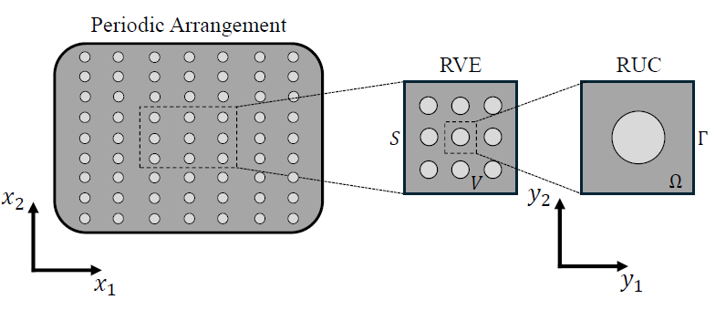
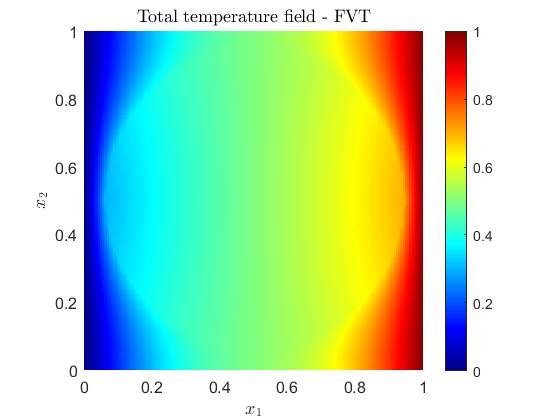
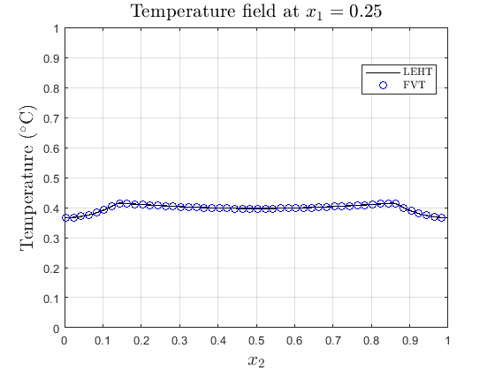
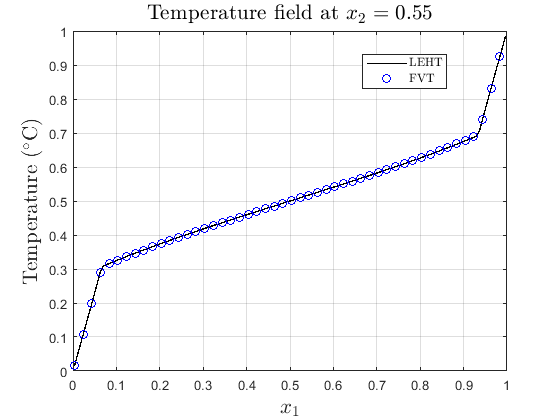

# 🔥 FVDAM-THERMAL

This repository features MATLAB codes developed to compute the effective thermal conductivity of periodic composite materials. The implementations include both a mean-field formulation and an energy-based formulation for numerical homogenization.

The models consider a square periodic unit cell containing a centered circular inclusion embedded in a surrounding matrix. Both the matrix phase and the inclusion (fiber) phase are assumed to be isotropic. In addition to evaluating the effective thermal conductivity matrix K<sup>*</sup>, the repository also provides visualization of the temperature field and microscopic temperature profiles along the coordinate directions.

---
## ⚙️ Features
* Highly vectorized, high-performance MATLAB implementation, minimizing loops and leveraging efficient sparse operations.
* Computes the effective thermal conductivity matrixK<sup>*</sup> from two unit macroscopic gradient tests.
* Periodic boundary conditions automatically enforced on the square RUC for thermal homogenization.
* Square periodic unit cell with a centered circular inclusion, where both matrix and inclusion are isotropic.
* Post-processing included: total temperature field visualization and microscopic temperature profiles along the coordinate directions.

<p align="center">
  
</p>

---
***Graphical Results:***

The command above will also generate the following plots:

|  |  |  |
| :---: | :---:  |:---: |

---


## 🔲 Finite-Volume Theory (FVT)
FVT is a numerical approach based on the spatial discretization of the RUC into subvolumes (finite volumes). To calculate the effective thermal conductivity  this repository offers **two distinct mathematical formulations:**

* **Based on Mean-Field Theory:** Mean-field theory is based on the principle that the effective thermal properties observed experimentally arise from averaging relationships between local fields (temperature gradients and heat fluxes) within microscopically heterogeneous materials. Consequently, the macroscopic fields are defined as volume averages of their corresponding microscopic fields, and the effective thermal properties emerge naturally from these average relations.

* **Based on Energy Theory:** In this approach, homogenization can be interpreted as the process of finding a homogeneous material that is energetically equivalent to a heterogeneous material with a complex microstructure. 


While these two theories take distinct mathematical routes, they are strictly equivalent. Both formulations lead to the exact same effective macroscopic properties, providing a double-validation of the numerical homogenization process.


### Syntax

The `mean_field.m` and `energy_based.m` functions compute the effective thermal conductivity matrix and plot the 2D temperature field for a composite material with a circular inclusion. Additionally, they extract the 1D micro-fields at specified cross-sections, directly comparing both the numerical profiles and the calculated effective conductivity against analytical results obtained from LEHT.
* mean_field(nx, ny, k_m, k_i, frac, field, x_cut, y_cut)
* energy_based(nx, ny, k_m, k_i, frac, field, x_cut, y_cut)


**Table 2:** Inputs parameters' declaration - FVT
---
| Parameter | Description | Values |
| :---: | :--- | :---: |
| **`nx`** | Number of sub volumes in the $x_1$ direction. | `50, 100, 150, ...` |
| **`ny`** | Number of sub volumes in the $x_2$ direction. | `50, 100, 150, ...` |
| **`k_m`** | Thermal conductivity of the matrix phase. | `> 0` |
| **`k_i`** | Thermal conductivity of the inclusion phase. | `> 0` |
| **`frac`** | Volume fraction of the circular inclusion. | `[0.05, 0.75]` |
| **`field`** | Enables or disables the plotting of the total 2D temperature field. | `0` (disable) or `1` (enable) |
| **`x_cut`** | Coordinate to extract the vertical temperature profile (compared with LEHT). | `0` (disable) or `0 < x_cut <= 1` |
| **`y_cut`** | Coordinate to extract the horizontal temperature profile (compared with LEHT). | `0` (disable) or `0 < y_cut <= 1` |


### Usage Example

To run the analysis using a $150 \times 150$ mesh, with a matrix conductivity of $0.5 \ W/(m \cdot ^\circ C)$, inclusion conductivity of $4.5 \ W/(m \cdot ^\circ C)$, and a volume fraction of 60 %, while also generating the 2D temperature field and extracting profiles at $x_1 = 0.25$ and $x_2 = 0.55$, execute the following command:

* energy_based(150, 150, 0.5, 4.5, 0.6, 1, 0.25, 0.55)

***Command Window Output:***
```text
====================================================
EFFECTIVE THERMAL CONDUCTIVITY MATRICES (K*)
====================================================
(FVT - BASED ON ENERGY THEORY) =
    1.4752    0.0000
    0.0000    1.4752

(LEHT - ANALYTICAL) =
    1.4722   -0.0000
    0.0000    1.4722
```

***Graphical Results:***

The command above will also generate the following plots:

| |  |  |
| :---: | :---:  |:---: |
---

##  💻 Requirements
The implementation of this tool was entirely developed in the MATLAB environment (version R2022b). Its development did not require the use of additional tools or packages, so the code can be executed in a standard MATLAB installation.

---

## ❌ Reporting issues

We strive to ensure that this Finite-Volume Theory implementation is accurate and efficient. However, if you encounter any unexpected behavior, inconsistencies, or potential bugs in the code, your feedback is highly appreciated.

Please feel free to reach out via email:
📩 diogo.santos@ctec.ufal.br

Your contributions help improve the reliability and usability of this project for the scientific community.

---

## 📚 Authors
Project developed by:
* Diogo Tiago dos Santos 📩 diogo.santos@ctec.ufal.br
* Márcio André Araújo Cavalcante 📩 marcio.cavalcante@ceca.ufal.br
* Romildo dos Santos Escarpini Filho 📩 romildo.escarpini@penedo.ufal.br
* Arnaldo dos Santos Júnior 📩 arnaldo@ctec.ufal.br
